# Diagrama de Entidade e Relacionamento

- **Author:** Caio Felipe
- **Version:** 0.0.1
- **Description:** Basic initial diagram

```mermaid
erDiagram
    %% ==========================================
    %% CORE (NÚCLEO, AUTH E ACL)
    %% ==========================================
    companies {
        bigint      id              PK
        char        uuid
        string      document
        string      corporate_name
        string      trade_name
        string      status
        timestamp   created_at
        timestamp   updated_at
        timestamp   deleted_at
    }

    users {
        bigint      id          PK
        bigint      company_id  FK
        char        uuid
        string      name
        string      email
        string      password
        string      mfa_secret
        boolean     mfa_enabled
        timestamp   last_login_at
        string      status
        timestamp   created_at
        timestamp   updated_at
        timestamp   deleted_at
    }

    roles {
        bigint      id PK
        char        uuid
        string      name
        string      guard_name
        string      description
        boolean     is_active
        timestamp   created_at
        timestamp   updated_at
        timestamp   deleted_at
    }

    permissions {
        bigint  id PK
        char    uuid
        string  name
        string  guard_name
        string  module
    }

    permission_role {
        bigint permission_id FK
        bigint role_id FK
    }

    role_user {
        bigint role_id FK
        bigint user_id FK
    }

    personal_access_tokens {
        bigint      id PK
        char        uuid
        string      tokenable_type
        bigint      tokenable_id
        string      name
        string      token
        string      abilities
        timestamp   expires_at
        timestamp   created_at
        timestamp   updated_at
        timestamp   deleted_at
    }

    audit_logs {
        bigint      id PK
        bigint      user_id FK
        char        uuid
        string      event
        string      auditable_type
        bigint      auditable_id
        json        old_values
        json        new_values
        string      ip_address
        timestamp   created_at
    }

    %% ==========================================
    %% INTEGRAÇÕES
    %% ==========================================
    acquirers {
        bigint      id PK
        char        uuid
        string      name
        string      status
        timestamp   created_at
        timestamp   updated_at
        timestamp   deleted_at
    }

    banks {
        bigint  id PK
        char    uuid
        string  code
        string  name
        string  status
    }

    acquirer_credentials {
        bigint      id PK
        bigint      acquirer_id FK
        char        uuid
        string      api_key_encrypted
        string      secret_encrypted
        timestamp   created_at
        timestamp   updated_at
        timestamp   deleted_at
    }

    integration_logs {
        bigint      id PK
        char        uuid
        json        payload
        json        headers
        string      ip_address
        integer     http_status
        timestamp   created_at
    }

    edi_files {
        bigint      id PK
        char        uuid
        string      file_name
        string      status
        string      hash
        timestamp   created_at
        timestamp   updated_at
        timestamp   deleted_at
    }

    edi_file_rows {
        bigint      id PK
        char        uuid
        bigint      edi_file_id FK
        string      raw_line_data
        string      status
        timestamp   created_at
        timestamp   updated_at
        timestamp   deleted_at
    }

    %% ==========================================
    %% CONCILIADOR
    %% ==========================================
    reconciliation_rules {
        bigint      id PK
        char        uuid
        string      name
        string      target_acquirer
        float       tolerance_amount
        timestamp   created_at
        timestamp   updated_at
        timestamp   deleted_at
    }

    rule_conditions {
        bigint      id PK
        char        uuid
        bigint      rule_id FK
        string      field_to_match
        string      operator
        string      value
        timestamp   created_at
        timestamp   updated_at
        timestamp   deleted_at
    }

    internal_sales {
        bigint      id PK
        bigint      company_id FK
        char        uuid
        string      nsu
        float       amount
        date        sale_date
        string      status
        timestamp   created_at
        timestamp   updated_at
        timestamp   deleted_at
    }

    acquirer_transactions {
        bigint      id PK
        bigint      acquirer_id FK
        bigint      settlement_batch_id FK
        char        uuid
        string      nsu
        float       gross_amount
        float       net_amount
        float       mdr_fee
        timestamp   created_at
        timestamp   updated_at
        timestamp   deleted_at
    }

    settlement_batches {
        bigint  id PK
        bigint  acquirer_id FK
        date    batch_date
        float   total_net_amount
    }

    bank_statements {
        bigint      id PK
        bigint      bank_id FK
        char        uuid
        date        statement_date
        float       amount
        string      transaction_type
        timestamp   created_at
        timestamp   updated_at
        timestamp   deleted_at
    }

    reconciliation_matches {
        bigint id PK
        bigint internal_sale_id FK
        bigint acquirer_transaction_id FK
        string status
    }

    divergences {
        bigint      id PK
        bigint      match_id FK
        char        uuid
        string      type
        string      reason
        timestamp   resolved_at
        timestamp   created_at
        timestamp   updated_at
        timestamp   deleted_at
    }

    %% ==========================================
    %% ERP
    %% ==========================================
    client_contracts {
        bigint      id PK
        bigint      company_id FK
        char        uuid
        date        start_date
        float       agreed_mdr
        string      status
        timestamp   created_at
        timestamp   updated_at
        timestamp   deleted_at
    }

    employees {
        bigint      id PK
        bigint      user_id FK
        char        uuid
        string      cpf
        float       salary
        date        admission_date
        timestamp   created_at
        timestamp   updated_at
        timestamp   deleted_at
    }

    financial_payables {
        bigint      id PK
        char        uuid
        string      description
        date        due_date
        float       amount
        string      status
        timestamp   created_at
        timestamp   updated_at
        timestamp   deleted_at
    }

    financial_receivables {
        bigint      id PK
        char        uuid
        bigint      company_id FK
        string      description
        date        due_date
        float       amount
        timestamp   created_at
        timestamp   updated_at
        timestamp   deleted_at
    }

    invoices {
        bigint      id PK
        bigint      receivable_id FK
        char        uuid
        string      invoice_number
        string      sefaz_status
        timestamp   created_at
        timestamp   updated_at
        timestamp   deleted_at
    }

    %% ==========================================
    %% OPERAÇÕES & SUPORTE
    %% ==========================================
    tickets {
        bigint      id PK
        char        uuid
        bigint      requester_id FK
        bigint      assigned_to FK
        string      subject
        string      status
        timestamp   created_at
        timestamp   updated_at
        timestamp   deleted_at
    }

    ticket_messages {
        bigint      id PK
        bigint      ticket_id FK
        bigint      user_id FK
        char        uuid
        string      message
        timestamp   created_at
        timestamp   updated_at
        timestamp   deleted_at
    }

    workflow_tasks {
        bigint      id PK
        bigint      completed_by FK
        char        uuid
        string      title
        string      step
        string      status
        timestamp   created_at
        timestamp   updated_at
        timestamp   deleted_at
    }

    %% ==========================================
    %% RELACIONAMENTOS (CARDINALIDADE)
    %% ==========================================

    %% CORE
    companies ||--o{ users : "has"
    users ||--o{ role_user : "has"
    roles ||--o{ role_user : "belongs to"
    roles ||--o{ permission_role : "has"
    permissions ||--o{ permission_role : "belongs to"
    users ||--o{ audit_logs : "generates"
    users ||--o{ personal_access_tokens : "owns"

    %% INTEGRAÇÕES
    acquirers ||--o| acquirer_credentials : "has one"
    edi_files ||--o{ edi_file_rows : "contains"
    acquirers ||--o{ acquirer_transactions : "registers"
    banks ||--o{ bank_statements : "issues"

    %% CONCILIADOR
    reconciliation_rules ||--o{ rule_conditions : "has"
    acquirers ||--o{ settlement_batches : "generates"
    settlement_batches ||--o{ acquirer_transactions : "groups"
    
    internal_sales ||--o| reconciliation_matches : "matched in"
    acquirer_transactions ||--o| reconciliation_matches : "matched in"
    reconciliation_matches ||--o| divergences : "may result in"

    %% ERP
    companies ||--o| client_contracts : "has one"
    users ||--o| employees : "is an"
    companies ||--o{ financial_receivables : "billed via"
    financial_receivables ||--o| invoices : "generates"

    %% OPERAÇÕES & SUPORTE
    users ||--o{ tickets : "requests/assigned"
    tickets ||--o{ ticket_messages : "contains"
    users ||--o{ ticket_messages : "writes"
    users ||--o{ workflow_tasks : "completes"

```

- **OBS:** Do not treat this as a definitive source of truth or final documentation; it is a basic, preliminary diagram intended to guide developers during the development process, and changes may occur.

